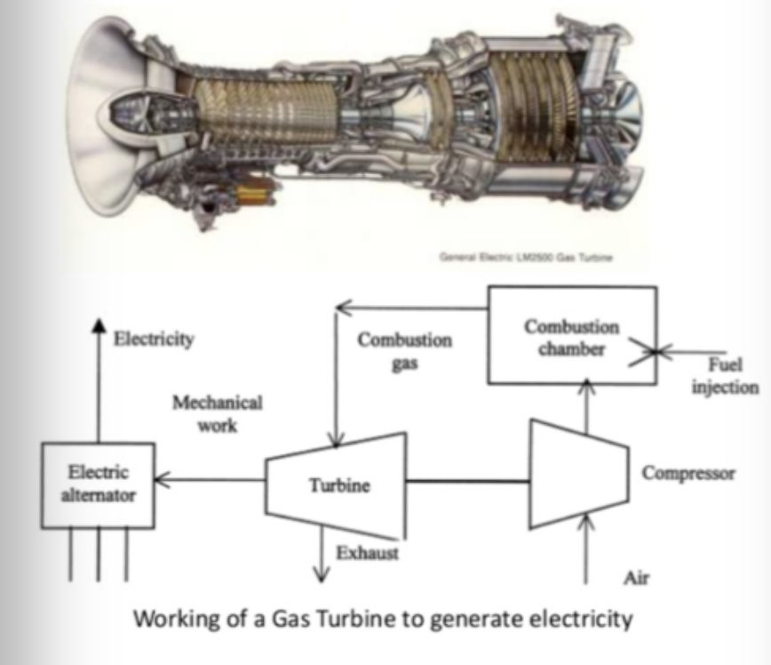

.. SA020-T01L02CM02: Brayton Cycles documentation master file, created by
   sphinx-quickstart on Tue Oct 31 13:20:06 2023.
   You can adapt this file completely to your liking, but it should at least
   contain the root `toctree` directive.

===========================================
Welcome to SA020-T01L02CM02: Brayton Cycles
===========================================

.. toctree::
   :hidden:

   activity_1.rst
   activity_2/index.rst
   activity_3.rst
   activity_4/index.rst

Dear Learner,

This Content Module includes 2 video lectures addressing fundamental principles, thermodynamics, mechanical work and efficiency of Brayton cycle machines

In the light of the pedagogical methodology, "student-centered education" requesting personal commitment and active participation by the learner, the module is built up around a set of voluntary (like watch, read, ..) and compulsory (multiple choice, open-ended, calculation, ...) activities in which the learner can self-determine the progress.

The learner is recommended to go through, in sequential order, the different activities throughout the module, starting with "Activity 1".

